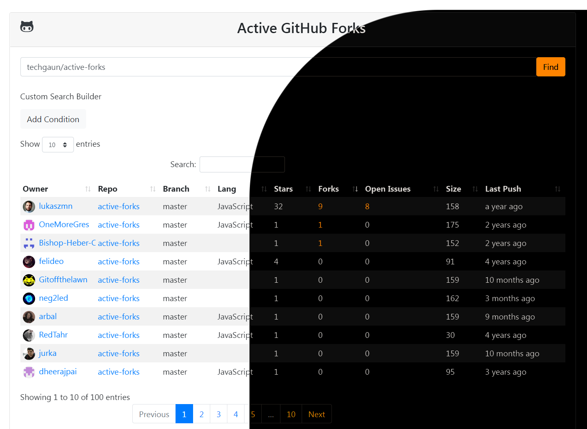

#  _GitHub_ active-forks

> Find the active github _forks_ of a project

This project allows you to find the most active _forks_ of a _repository_.

[丫 Find Active Fork](https://techgaun.github.io/active-forks/index.html)

## As Bookmarklet

If you would like to use this tool as a [_bookmarklet_](https://en.wikipedia.org/wiki/Bookmarklet),
you can do so by saving the following _JavaScript_ code as the _bookmarklet_.
Since _GitHub_ doesn't allow _JavaScript_ in its _Markdown_, you can add it manually.
Hit `Ctrl+D` to create a **new bookmark** and paste the _JavaCcript_ below into the `URL`
or _"Location"_ entry (you may have to click _"More"_ to see the `URL` field).
Any time you're on a _GitHub_ repo you can click the bookmarklet
and it'll bring up the _Active Forks_ of that repo.

```javascript
javascript:/*active-forks bookmarklet*/!function(){if(title=document.title,title)if(thing=title.split(/(GitHub\s-\s)*([^:]*)/)[2],thing){var t="https://eapo.github.io/active-forks/index.html#"+thing;window.open(t)} else window.alert("Not%20a%20valid%20GitHub%20page")}();
```

It's recommended to use just the `丫` [U+4E2B Character](https://unicode-table.com/en/4E2B/) as the name of the _bookmarklet_ to keep it short and clear.



## Features
- **List forks** of a GitHub repository
- **Advanced Filter** listings using _Custom Search Builder_
- **Simple Filter** listing using _Search_ term
- **List `10|25|50|100`** entrieswith _Previous_|_Next_|_&numero;_ pager
- **`ASC|DESC` Sort** listing by data type
- **`URL`** to _Repo_|_Owner_|_Forks_|_Open Issues_
